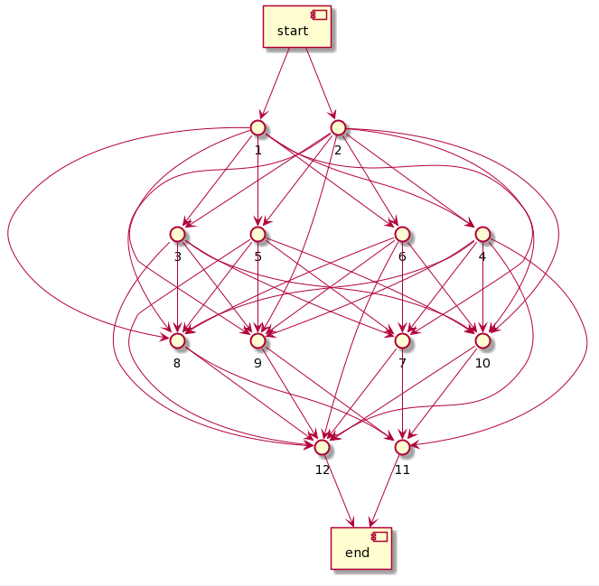
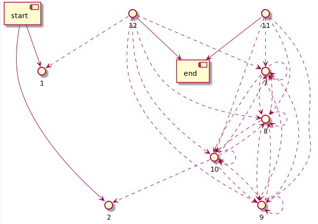

### Erlang Neural Networks (nnet) is an application to represent neural networks in erlang terms.


# Installation
Create your own project with rebar3.
 ```sh
 $ rebar3 new app yourapp
 ```

Then in your project path find rebar.config file and add nnet as dependency under the deps key:
```erlang
{deps, 
    [
        {nnet, {git, "https://github.com/BorjaEst/nnet.git", {tag, "<version>"}}}
    ]}.
```

Then using compile command, rebar3 will fetch the defined dependencies and compile them as well for your application.
```sh
$ rebar3 compile
```

At the end for making a release you first need to create your release structure and then making a release with following commands.
```sh
$ rebar3 new release yourrel
$ rebar3 release
```

>You can find more information about dependencies in [rebar3 - dependencies](https://www.rebar3.org/docs/dependencies). 


# Usage
Load the app using your prefered method. For example in the project folder executing  rebar3 shell:
```sh
$ rebar3 shell
===> Booted nnet
```

All user functions are defined inside the module [src/nnet](https://github.com/BorjaEst/nnet/blob/master/src/nnet.erl), however here is an example:


## Start tables
As library without OTP supervision tree, the best way to start is to ensure the tables are created. 
```erl
1> nnet:start_tables().
ok
```
> The function will not fail if the tables are already created and correct.

## Create a network from a model
To create a network from a model it is very easy. Just create a map where each layer is a key (inputs & outputs are mandatory) and the values are:
- "connections": Type of connection and density between layers.
- "units": The amount of neurons on each layer.
- "data": The information on each node on each layer.

```erl
2> {atomic, Id} = nnet:from_model(
2>     #{inputs  => #{connections => #{
2>                    layer1  => sequential,
2>                    layer2  => {sequential,0.5}}, 
2>                   units => 2, data=>#{}},
2>       layer1  => #{connections => #{
2>                    layer2  => sequential,
2>                    outputs => {sequential,0.5}}, 
2>                   units => 4, data=>#{}},
2>       layer2  => #{connections => #{
2>                    layer2  => recurrent,
2>                    outputs => sequential}, 
2>                   units => 4, data=>#{}},
2>       outputs => #{connections => #{
2>                    inputs  => {recurrent, 0.5},
2>                    layer2  => recurrent}, 
2>                   units => 2, data=>#{}}}
2> ).
{atomic,{network,#Ref<0.2777356943.329777157.190811>}}
```

## Get the network nodes, inputs and outputs
Using the function `nnet:info/1` you can retrieve the network data.
```erl
3> {atomic, #{nnodes:=NNodes}} = nnet:info(Id).
{atomic,#{inputs =>
              [{{network,#Ref<0.2777356943.329777157.190811>},
                {nnode,#Ref<0.2777356943.329777157.190775>}},
               {{network,#Ref<0.2777356943.329777157.190811>},
                {nnode,#Ref<0.2777356943.329777157.190778>}}],
          nnodes =>
              #{{nnode,#Ref<0.2777356943.329777157.190775>} => nnode,
                {nnode,#Ref<0.2777356943.329777157.190778>} => nnode,
                {nnode,#Ref<0.2777356943.329777157.190781>} => nnode,
                {nnode,#Ref<0.2777356943.329777157.190784>} => nnode,
                {nnode,#Ref<0.2777356943.329777157.190787>} => nnode,
                {nnode,#Ref<0.2777356943.329777157.190790>} => nnode,
                {nnode,#Ref<0.2777356943.329777157.190793>} => nnode,
                {nnode,#Ref<0.2777356943.329777157.190796>} => nnode,
                {nnode,#Ref<0.2777356943.329777157.190799>} => nnode,
                {nnode,#Ref<0.2777356943.329777157.190802>} => nnode,
                {nnode,#Ref<0.2777356943.329777157.190805>} => nnode,
                {nnode,#Ref<0.2777356943.329777157.190808>} => nnode},
          outputs =>
              [{{nnode,#Ref<0.2777356943.329777157.190805>},
                {network,#Ref<0.2777356943.329777157.190811>}},
               {{nnode,#Ref<0.2777356943.329777157.190808>}, 
                {network,#Ref<0.2777356943.329777157.190811>}}]}}
```
> Note the network inputs are out(Network): Network -> NNode

> Note the network outputs are in(Network):   NNode -> Network


## Get a nnode inputs and outputs
After a network is create, you can modify it using the functions:
```erl
%% NNode operations (run inside 'fun edit/1') 
-export([rnode/1, wnode/2, rlink/1, wlink/2]).
-export([out/1, out_seq/1, out_rcc/1, in/1, lx/1]).
%% Connections operations (run inside 'fun edit/1')
-export([connect/1, connect_seq/1, connect_rcc/1, disconnect/1]).
-export([move/2, reset/1]).
%% Network operations (run inside 'fun edit/1')
-export([copy/2, clone/2, divide/2, split/2, delete/2, join/2]).
```


# Visualization
There is a secret (not so secret) module "umlnn" which prints/formats the neural network in UML format (components diagram).
You can use the results of that function together with [plantUML](http://www.plantuml.com/plantuml/uml) to display your nerwork.

To display the sequential connections use the output from: `umlnn:print_seq(Network_id)`



To display the recurrent connections use the output from: `umlnn:print_rcc(Network_id)`




# More examples
Inside the module **./src/nnet.erl** you will find the spec and comments for each function. Note that most of the functions are mnesia transactions therefore should run inside a `mnesia:transaction/1` context.

For examples of usage you can take a look on the test suite **./test/nnet_SUITE.erl**.


# Contributing
Pull requests are welcome. For major changes, please open an issue first to discuss what you would like to change.

Please make sure to update tests as appropriate.


## Improvement ideas and requests
All ideas and sugestions are welcome:
- <TBD>


# License
This software is under [GPL-3.0](https://www.gnu.org/licenses/gpl-3.0.en.html) license.

